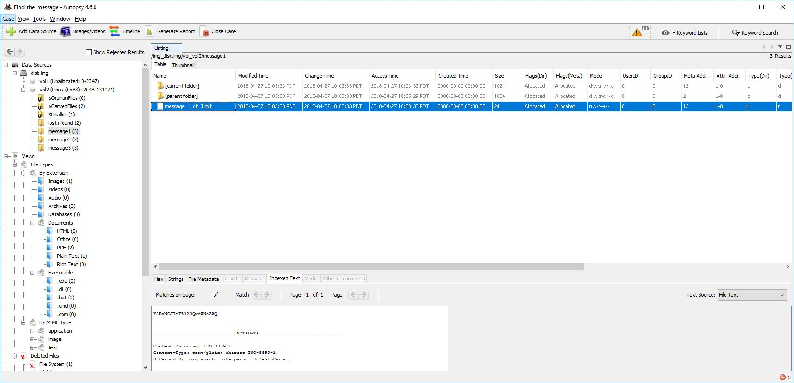
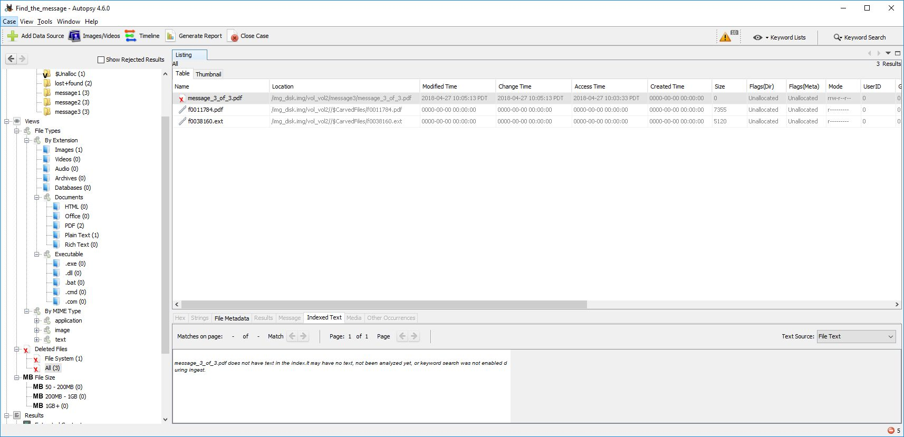
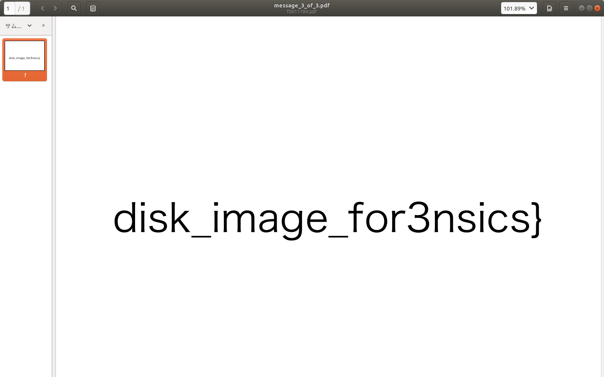

# Find the messages

## Question

ディスクイメージに隠されているメッセージファイルを探せ！

[disk.img](disk.img_de4d3f06696ce78c1646ed140a0ca4e5fbe4c0aa.7z)

## Answer

とりあえず`Autopsy`で開いてみると、



Linuxのファイルシステムがあって

- `message_1_of_3.txt`
- `message_2_of_3.png`
- `message_3_of_3.pdf`

というファイルがあることがわかる。

[message_1_of_3.txt](Export/message_1_of_3.txt)

```bash
$ echo -n "Y3RmNGJ7eTB1X3QwdWNoZWQ=" | base64 -d
ctf4b{y0u_t0uched
```

[message_2_of_3.png](Export/message_2_of_3.png.bak)

PNGファイルのはずなのに`data`となる

```bash
$ file message_2_of_3.png
message_2_of_3.png: data
```

`hexdump`してみる

```bash
$ hexdump -C message_2_of_3.png -n 16
00000000  58 58 58 58 58 58 58 58  00 00 00 0d 49 48 44 52  |XXXXXXXX....IHDR|
00000010
```

```plain
バイナリ 10バイト分例
bmp : BM< (42 4d 3c 00 00 00 00 00 00 00)
exe : MZ (4d 5a 90 00 03 00 00 00 04 00)
gif : GIF89a (47 49 46 38 39 61 01 00 01 00)
jpg : ÿØÿàJFIF (ff d8 ff e0 00 10 4a 46 49 46)
pdf : %PDF-1.5 % (25 50 44 46 2d 31 2e 35 0d 25)
png : ‰PNG  (89 50 4e 47 0d 0a 1a 0a 00 00)
psd : 8BPS (38 42 50 53 00 01 00 00 00 00)
tif : II* (49 49 2a 00 08 00 00 00 15 00)
zip : PK (50 4b 03 04 0a 00 00 00 00 00)
docx : PK (50 4b 03 04 14 00 06 00 08 00)
xlsx : PK (50 4b 03 04 14 00 06 00 08 00)
pptx : PK (50 4b 03 04 14 00 06 00 08 00)
doc : ��ࡱ� (d0 cf 11 e0 a1 b1 1a e1 00 00)
xls : ��ࡱ� (d0 cf 11 e0 a1 b1 1a e1 00 00)
pptx : ��ࡱ� (d0 cf 11 e0 a1 b1 1a e1 00 00)
```
[ファイルのマジックバイト判定](http://php.o0o0.jp/article/php-magicbytes)より


どうやら先頭のマジックナンバーが書き換えられてるようなので`hexedit`などで書き換えてやる

```bash
$ hexdump -C message_2_of_3.png -n 16
00000000  89 50 4e 47 0d 0a 1a 0a  00 00 00 0d 49 48 44 52  |.PNG........IHDR|
00000010
$ file message_2_of_3.png
message_2_of_3.png: PNG image data, 5003 x 2239, 8-bit/color RGB, non-interlaced
```


これでちゃんとPNGとして認識してくれた

次に`message_3_of_3.pdf`



しかし`message_3_of_3.pdf`は削除されてしまっているようだが`$CarvedFiles`にファイル本体は残っているみたい

[f0011784.pdf](Export/f0011784.pdf)



よって、

`ctf4b{y0u_t0uched_a_part_0f_disk_image_for3nsics}`