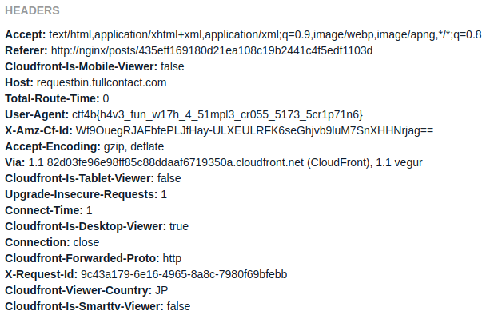

# Gimme your comment

## Question

ビギナーズカンパニーは皆様からのご意見をお待ちしています。
お問合わせの回答には特別なブラウザを使用しており、このブラウザの `User-Agent` が分かった方には特別に得点を差し上げます :-)

[http://gyc.chall.beginners.seccon.jp](http://gyc.chall.beginners.seccon.jp)

[worker.js](worker_63589eb583b5281458486ae738efd63e04f502b7.js)

## Answer

[http://gyc.chall.beginners.seccon.jp/posts](http://gyc.chall.beginners.seccon.jp/posts)
の本文にXSSの脆弱性があるの

`worker.js`を見るとちゃんと`headerlessブラウザ`で管理者は巡回してるようなので

[requestbin](https://github.com/Runscope/requestbin)などを使って以下のスクリプトを本文に流し込んで管理者の`User-Agent`を取得する。

``

`ctf4b{h4v3_fun_w17h_4_51mpl3_cr055_5173_5cr1p71n6}`